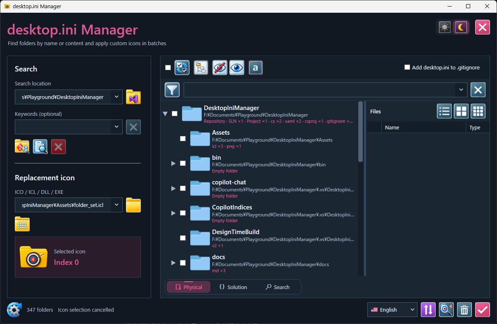
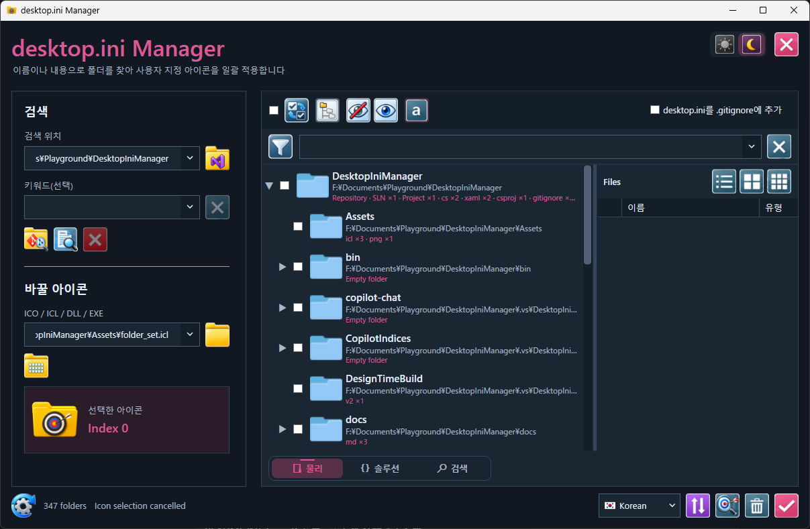

# DesktopIniManager v3.0.0 — DIR edition

DesktopIniManager is a Windows workspace for exploring development folders,
browsing Visual Studio solutions, searching source code, comparing working
trees, and applying custom folder icons through `desktop.ini`.

**v3.0.0 is the DIR edition.** Workspace acquisition uses the Windows
`dir /s /b` command to build a reusable path index. Grep and folder comparison
use ordinary file-system access. This edition does not read the NTFS MFT
and does not require elevation just to enumerate folders.


## Download and requirements

Release package: **DesktopIniManager-v3.0.0-DIR-win-x64.zip**

Download the asset from [GitHub Releases](https://github.com/K-Tamashiro/DesktopIniManager/releases)
when v3.0.0 is published. A locally generated package is placed in `release/`.
See the [v3.0.0 release notes](docs/releases/v3.0.0-DIR.md).

- Windows 10 or Windows 11, x64.
- .NET 10 Desktop Runtime (x64) must be installed separately.
- Read access to the folders being inspected; write access for icon changes and synchronization.
- MSBuild is required only for **Clean solution**. External editors/diff tools are optional.

Extract the ZIP into a new folder and run `DesktopIniManager.exe`.
Keep the accompanying application DLLs, JSON files, `Assets`, and `Languages` together.
When upgrading from v2.x, use a fresh extraction directory to avoid mixing
.NET Framework and .NET 10 files.

Network and cloud-backed locations depend on their provider, connectivity,
permissions, and availability of file contents. They are not covered by a
blanket compatibility guarantee. Make cloud files available locally before
reading or synchronizing them.

## Three retained workspace views

### Physical and repository acquisition

Choose a search location and use the repository-acquisition button to build
the **Physical** and **Solution** trees. The Physical view shows the on-disk
folder structure, repository markers, and summaries of files in each folder.
A saved, valid search root is acquired while the splash screen is displayed
at the next startup.


### Solution

The Solution view presents the projects reconstructed from Visual Studio
solution files. Switch between Physical and Solution while retaining the
workspace. Solution parsing reports progress and the current solution.


### Search

Search has its own results tree. Temporary searches and filters do not replace
the acquired Physical and Solution trees. Use keywords or extensions to find
folders and files, then narrow the displayed results with the filter field.


Tree controls support selection/inversion, expansion/collapse, hiding/restoring
folders, and compact display. The file pane offers list, large-icon, and
small-icon layouts. Paths and search terms have independent input histories;
long history paths prioritize the end of the path.

## Scoped Code Search

Select the projects or folders you need and open Grep. Scopes from different
tree branches are retained; a selected ancestor covers its selected descendants.
Folders can also be dropped into the Grep window.


- Multiple scopes and language profiles, with editable extension filters.
- Plain-text or regular-expression search, match case, and whole word.
- File, line, column, and matching text in grouped, filterable results.
- Progress and cancellation, result export, and input history.
- External editor presets including MIFES, Hidemaru, Mery, and VS Code.

## Developer Differencer

Open **Developer Differencer** using the comparison button at the bottom
of the main window. Choose Source and Target roots, compare them, and select
the differences to synchronize in either direction.


Files are matched by relative path and compared by size and, when
**Compare dates** is enabled, last-write time at whole-second precision.
This does not compare file contents or hashes. With dates disabled,
equal-sized files are classified as identical.

Combine **Same / Diff / Left / Right** filters and optionally include
`obj` and `bin`. Folder selection follows the visible difference categories;
previously checked files remain selected when hidden by a filter. The root
shows files from all levels. **Update** refreshes already-listed direct
files in the selected folder; use Compare to discover new files.

Synchronization presents copy, overwrite, and delete counts before execution.
**A checked file present only on the receiving side is deleted from that side.**
Review the direction and selection before confirming. Identical files are
viewable but are not synchronization candidates. Metadata directories
`.git`, `.vs`, and `.vscode` are excluded.

### Diff View


Text comparison includes line numbers, colored changes, linked scrolling,
a central difference map, and navigation between changes. Text can be
selected across lines without copying the displayed line numbers.
Image comparison provides shared zoom, Fit, and 100% views.

Diff View is read only. Open either file in its associated application,
or send both files to an external diff tool. External diff presets include
VS Code, MIFES, WinMerge, and Visual Studio; changed files are refreshed
when returning to the viewer.

### Clean solution

Choose solutions and configurations to run MSBuild Clean before comparing
again. Solutions containing the running application are excluded from Clean.
To clean DesktopIniManager itself, run the extracted release from a separate
directory outside that solution.

See the [comparison and synchronization guide](docs/mft-differencer.md)
for details and limitations.

## Folder icons

Choose an ICO, ICL, DLL, or EXE resource, select folders, and apply the icon.
The bundled `Assets/folder_set.icl` contains development-oriented folder icons.


DesktopIniManager writes `IconResource` in `desktop.ini`, sets the necessary
file/folder attributes, and refreshes Explorer. It can also add `desktop.ini`
to `.gitignore`. Remove clears the customization.


## Themes and languages

Switch between light and dark themes. English, Japanese, Simplified Chinese,
and Korean can be selected without restarting; the choice is retained.


| English | Japanese |
| --- | --- |
|  |  |

| Simplified Chinese | Korean |
| --- | --- |
|  |  |

## Build and package

Use the .NET 10 SDK on Windows, or Visual Studio with .NET 10/WPF support.

```powershell
dotnet build DesktopIniManager.sln -c Release
pwsh -File scripts/Build-Release.ps1
```

The packaging script publishes a framework-dependent Windows x64 application to a
fresh staging directory, validates its version and exact file layout, and writes:

```text
release/
  DesktopIniManager-v3.0.0-DIR-win-x64.zip
  DesktopIniManager-v3.0.0-DIR-win-x64.zip.sha256
```

The ZIP contains the application at its root:

```text
DesktopIniManager.exe
DesktopIniManager.dll
DesktopIniManager.deps.json
DesktopIniManager.runtimeconfig.json
FastVolumeIndex.Core.dll
Assets/
  folder_set.icl
  DeveloperDifferencer_iconset.icl
  Flag.icl
Languages/
README.md
docs/
```

The application and `FastVolumeIndex.Core` are the two solution projects.
The library retains its historical name; this edition's workspace acquisition
uses DIR. The deleted `FastVolumeIndex.Cli` / `mftree.exe` is not included.

The standalone regression harness is separate from the application solution:

```powershell
dotnet build Tests/DesktopIniManager.DifferencerTests.csproj -c Release
dotnet run --project Tests/DesktopIniManager.DifferencerTests.csproj -c Release --no-build
```

The older [SMVVM progress memo](docs/smvvm-progress.md) is historical.
v3.0.0 includes the subsequent refactoring, UI finishing, unused-code cleanup,
and updated screenshots.
