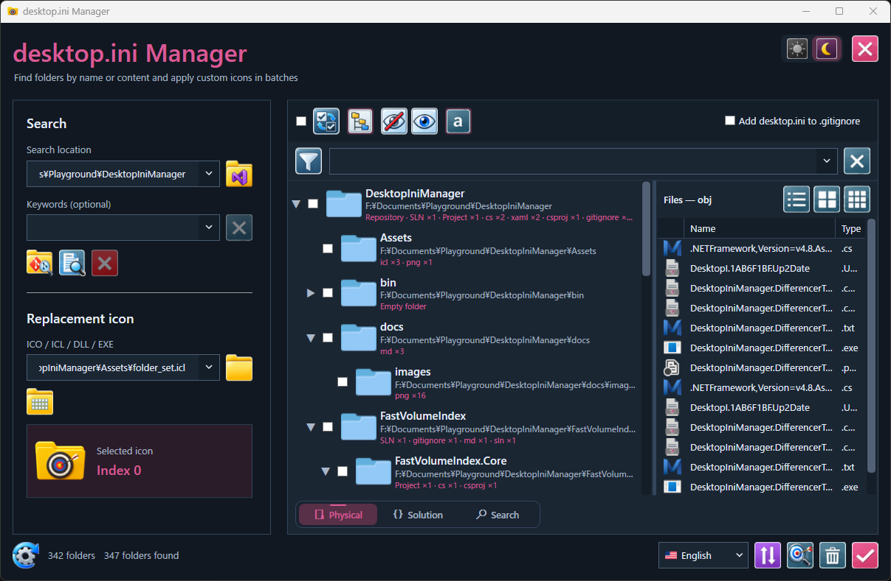
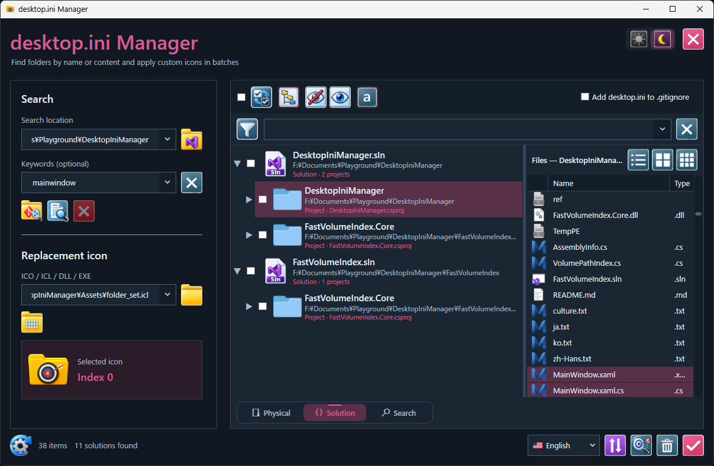
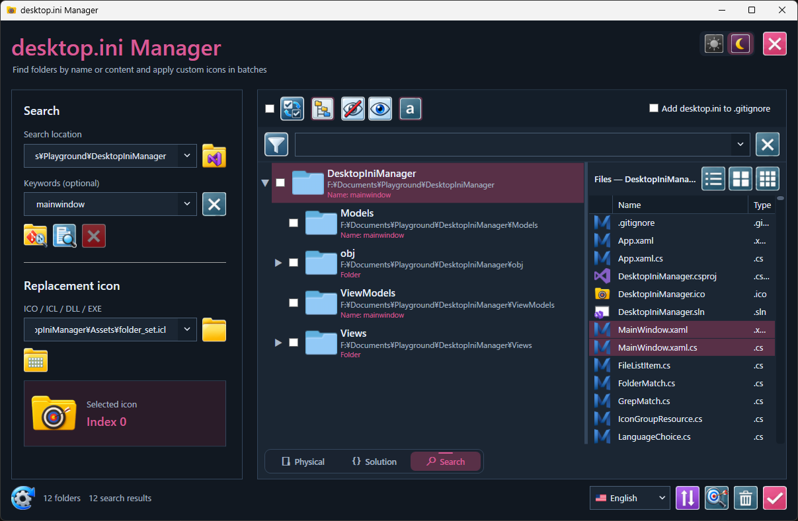
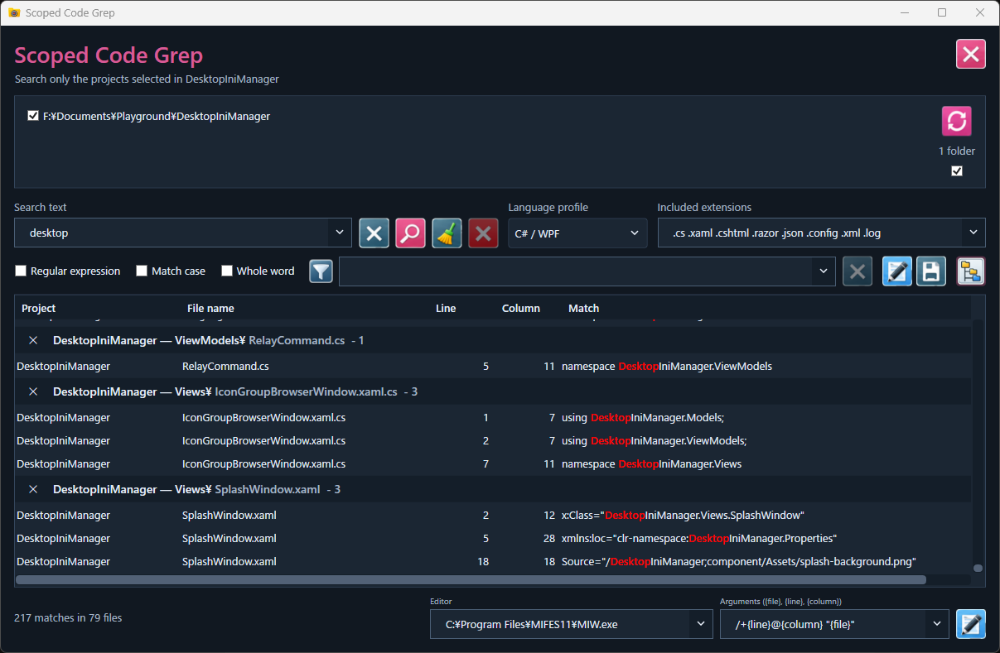
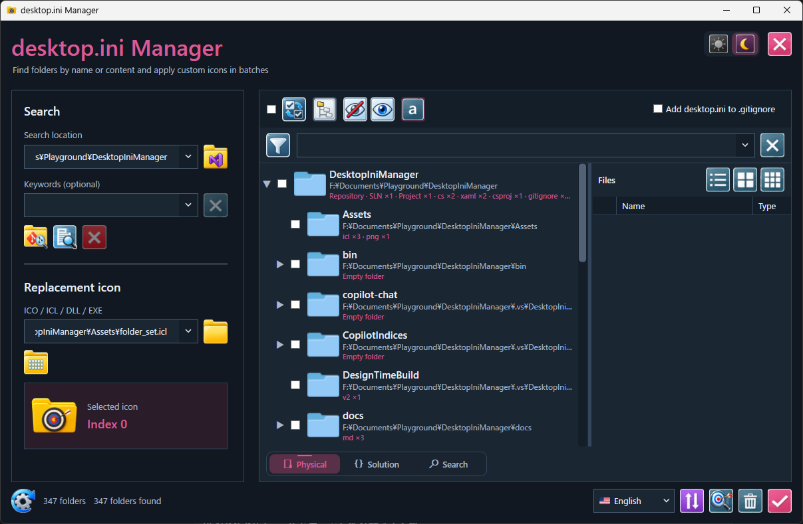
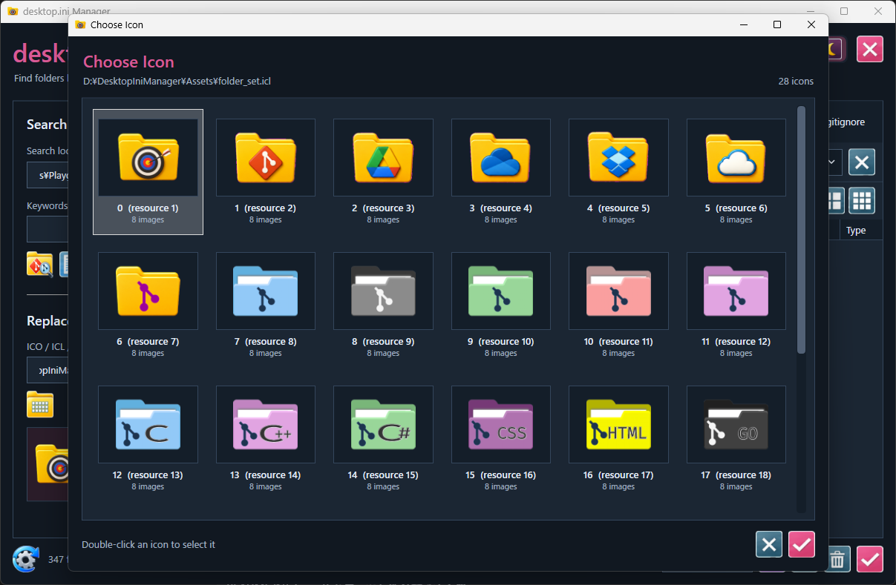
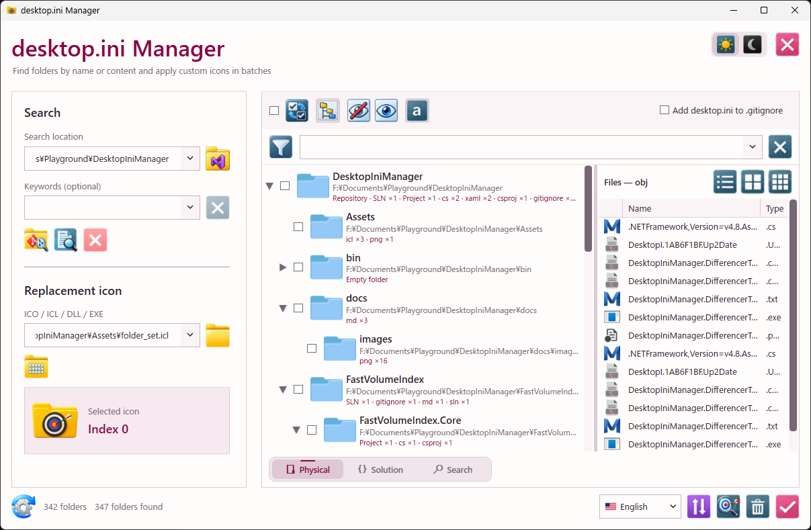
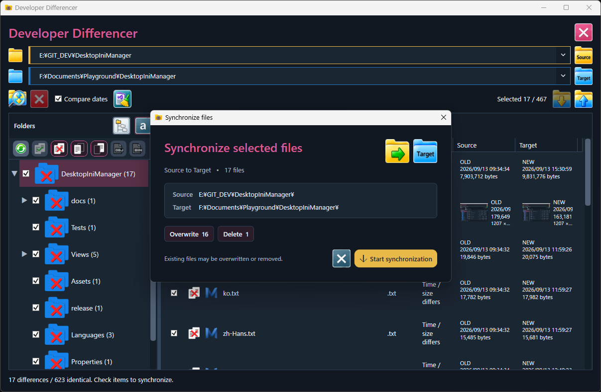
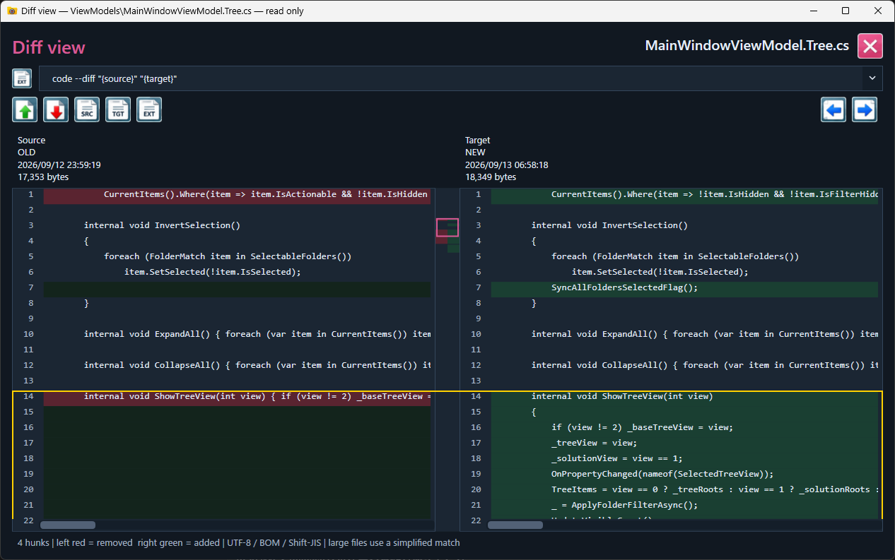

# DesktopIniManager

DesktopIniManager is a Windows developer tool for exploring development
folders, understanding project structure, searching source code, and
applying custom folder icons through `desktop.ini`.

Version **1.6.0** expands the original folder-icon manager into a
project-oriented workspace. Physical folders, Visual Studio solution
structure, search results, file lists, scoped Grep, and icon resources
can all be handled from one application.



## Download

[](https://github.com/K-Tamashiro/DesktopIniManager/releases/latest/download/DesktopIniManager-v1.6.0-win-x64.zip)

Download `DesktopIniManager-v1.6.0-win-x64.zip`, extract it to a
writable folder, and run `DesktopIniManager.exe`.

### Requirements

-   Windows 10 or Windows 11, x64
-   .NET Framework 4.8
-   Administrator permission when `Use fast NTFS search` is enabled

## What DesktopIniManager does

### MFT Differencer

Open **MFT Diff** to compare two working trees, inspect readonly text/image
diffs, and synchronize checked files in either direction. `.git` is excluded.
MFT enumeration requires local NTFS and administrator permissions; when MFT
enumeration is unavailable, comparison falls back to a file-system scan.
See [usage, safeguards, and regression tests](docs/mft-differencer.md).

Development work often requires several separate tools: Explorer for the
physical layout, Visual Studio for the logical solution structure, a
file-search tool, a Grep tool, and another utility for folder
customization.

DesktopIniManager brings those views together around the development
folder itself.

The **Physical**, **Solution**, and **Search** tabs are independent.
Running a search no longer destroys the folder or solution tree already
acquired, so you can move between the actual disk structure, the Visual
Studio-oriented structure, and temporary search results without
rebuilding your working context.

## Version 1.5.0 highlights

-   Physical, Solution, and Search views retained independently as tabs
-   Visual Studio `.sln` / project analysis for a logical Solution tree
-   NTFS MFT-based high-speed indexing through `FastVolumeIndex.Core`
-   Refactored MFT and path-index pipelines to reduce repeated
    filesystem traversal
-   Hidden Windows folders excluded from the physical tree
-   Project and source-language analysis
-   Folder-name and extension-based search
-   File list synchronized with the selected folder
-   Small/large icon file views
-   Non-modal **Scoped Code Search**
-   Grep scopes selectable directly from the project/folder tree
-   Regular expression, Match case, and Whole word Grep options
-   Language profiles and editable extension sets
-   External-editor navigation to matching line and column
-   ICO / ICL / DLL / EXE icon-resource browser
-   Batch `desktop.ini` apply/remove
-   Optional `desktop.ini` registration in `.gitignore`
-   Light and dark themes
-   Bundled `mftree.exe` CLI

## Three retained project views

### Physical

The Physical tab shows the actual folder hierarchy on disk. It is the
base view for understanding where projects, assets, output folders,
documents, and other resources physically exist.

Selecting a folder displays its files in the right pane.


### Solution

The Solution tab reconstructs the logical structure from Visual Studio
solution and project information. This makes it possible to compare the
structure developers see in Visual Studio with the real physical folder
layout.



### Search

Search results have their own tab instead of replacing the current
folder tree. Searches can therefore be repeated while the Physical and
Solution views remain available.

Multiple keywords/extensions can be used to narrow the result set.



## Fast NTFS search

`Use fast NTFS search` reads the local NTFS Master File Table rather
than recursively opening every directory.

DesktopIniManager uses `FastVolumeIndex.Core` to build an in-memory
representation of the volume and then constructs the required
folder/path indexes from that data. Version 1.5.0 further reduces
unnecessary full-volume path processing and repeated traversal of the
same search scope.

This is particularly useful when the search root contains large
repositories or many development projects.

Direct NTFS volume access requires administrator permission. Standard
filesystem traversal remains available when fast NTFS search cannot be
used.

## Project analysis

`GIT` acquisition identifies development repositories and analyzes the
folders below them.

DesktopIniManager recognizes common development structures including:

-   `.sln`, `.slnx`
-   `.csproj`, `.vbproj`, `.fsproj`, `.vcxproj`
-   `.vbp`, `.dproj`, `.dpr`
-   `package.json`, `composer.json`, `pyproject.toml`
-   `Cargo.toml`, `go.mod`, `pom.xml`
-   Gradle, CMake, Make, and related project markers

Generated and dependency folders such as `.git`, `.vs`, `bin`, `obj`,
`node_modules`, `vendor`, `dist`, and `target` are excluded where
appropriate.

## Scoped Code Search

DesktopIniManager includes a non-modal Grep window designed specifically
for project work.

Instead of searching an entire development drive and then filtering a
large number of unrelated hits, select only the project folders you need
and run Grep against those scopes.



Features include:

-   Multiple selected project/folder scopes
-   Parent/child scope de-duplication
-   C# / WPF and other language profiles
-   Editable included extensions
-   Regular expressions
-   Match case
-   Whole word
-   File, line, column, and matched-text display
-   Configurable external editor
-   Line/column arguments such as MIFES `/+{line}@{column} "{file}"`

This allows DesktopIniManager to act as a project-aware front end to
source-code search rather than a general whole-PC Grep utility.

## File view

Selecting a folder in the tree displays the files physically contained
in that folder.

The file pane supports list and icon layouts, and matching files can be
visually identified when working from Search results. Files can be
opened directly with their associated application.



## Folder icon management

The original purpose of DesktopIniManager remains fully integrated.

Choose an ICO, ICL, DLL, or EXE resource and apply the selected icon to
one or more folders. The bundled `Assets/folder_set.icl` provides a
ready-to-use development-oriented folder set.



For each selected folder, DesktopIniManager:

1.  Writes `[.ShellClassInfo]` and `IconResource` to `desktop.ini`.
2.  Marks `desktop.ini` as Hidden and System.
3.  Applies the folder attributes required by Explorer customization.
4.  Refreshes Explorer after the batch operation.
5.  Optionally adds `desktop.ini` to `.gitignore`.

`Remove` deletes the customization and restores the folder to its normal
icon state.

## Light and dark themes

The complete workspace can be switched between dark and light themes.



## mftree command-line tool

Version 1.5.0 also includes `mftree.exe`, a command-line tool powered by
`FastVolumeIndex.Core`.

Run it from an administrator terminal:

``` powershell
mftree
mftree /f
mftree "E:\Develop"
mftree "E:\Develop" /f
```

The default form prints folders. `/f` includes files, providing an
MFT-backed alternative for quickly inspecting large directory trees.

Add the extracted release directory to `PATH` if you want to invoke
`mftree` from any location.

## Typical workflow

1.  Choose the development root.
2.  Enable fast NTFS search when working on a local NTFS volume.
3.  Run `GIT` to acquire the Physical and Solution structures.
4.  Switch between Physical and Solution without rebuilding either tree.
5.  Use Search for temporary folder/file filtering.
6.  Select only the required projects and run Scoped Code Search.
7.  Inspect files in the right pane or open a match in the configured
    editor.
8.  Apply project-specific folder icons where visual identification in
    Explorer is useful.

## Build from source

Requirements:

-   Visual Studio 2022 or newer
-   .NET desktop development workload
-   .NET Framework 4.8 targeting pack

Build with Visual Studio MSBuild:

``` powershell
MSBuild.exe DesktopIniManager.sln /t:Rebuild /p:Configuration=Release
```

The solution contains the DesktopIniManager application, reusable
`FastVolumeIndex.Core`, and the `mftree` command-line tool.

## Release package contents

``` text
DesktopIniManager.exe
FastVolumeIndex.Core.dll
mftree.exe
Assets/
  folder_set.icl
  MftDifferencer_iconset.icl
README.md
RELEASE_NOTES_v1.6.0.md
docs/
```

## Version

Current release: **DesktopIniManager 1.6.0**

## MFT Differencer

Open **MFT Diff** from the main window to compare two folder trees, inspect
their differences, and synchronize only the files you select. Source and
Target identify the left and right roots; either side can be the source of
a synchronization operation. Git history remains separate: `.git` files
and directories are excluded from comparison and synchronization.

### Compare and select files



Choose **Source** and **Target**, then click **Compare**. Progress appears
at the bottom of the window. Files are matched by their paths relative to
each root and classified using size and, when **Compare dates** is enabled,
last-write time. This is a metadata comparison, not a content or hash check.
Turning off **Compare dates** treats equal-sized files as identical even
when their timestamps differ.

- **Same / Diff / Left / Right** can be combined to filter the folder tree
  and file list. Initially, **Diff**, **Left**, and **Right** are enabled.
  Relevant parent folders remain visible.
- Select the root to see matching files from all levels in **Name** order.
  Selecting a folder narrows that list while preserving its order. Files
  with the same name are ordered by relative path.
- Source and Target show timestamps, file sizes, and **NEW / OLD** where
  applicable. Supported images also show thumbnails and image dimensions.
- Check a folder to select the differences of the currently displayed
  categories beneath it, or check individual files. Selections survive
  filtering; identical files are available for viewing only.

### Read-only Diff View



Double-click a file to open **Diff View**. Text is displayed side by side
with line numbers and colored additions, removals, and changes. **Prev**
and **Next**, or a marker in the central difference map, navigate between
changed sections.

The frame in the central map shows the current visible range. Drag it up
or down to scroll both panes together. The frame also follows ordinary
scrolling and window resizing. Vertical scrollbars are hidden; the mouse
wheel still scrolls vertically. A horizontal/side wheel or **Shift + wheel**
scrolls horizontally, with both panes linked.

Images use a side-by-side view with shared zoom and aligned positions.
**Open Source** and **Open Target** send the corresponding file to the
configured external editor. Diff View itself does not edit, save, or merge
files.

### Synchronize selected differences

Choose **Source → Target** or **Target → Source**, then review the file count
and the copy, overwrite, and delete totals before running synchronization.
Only checked differences are processed, including checked files currently
hidden by a filter.

Files present only on the sending side are copied; files that differ on
both sides are overwritten. **A checked file present only on the receiving
side is deleted from that side.** Results and failures are recorded in the
sync log, and comparison runs again afterward to refresh remaining
differences.
