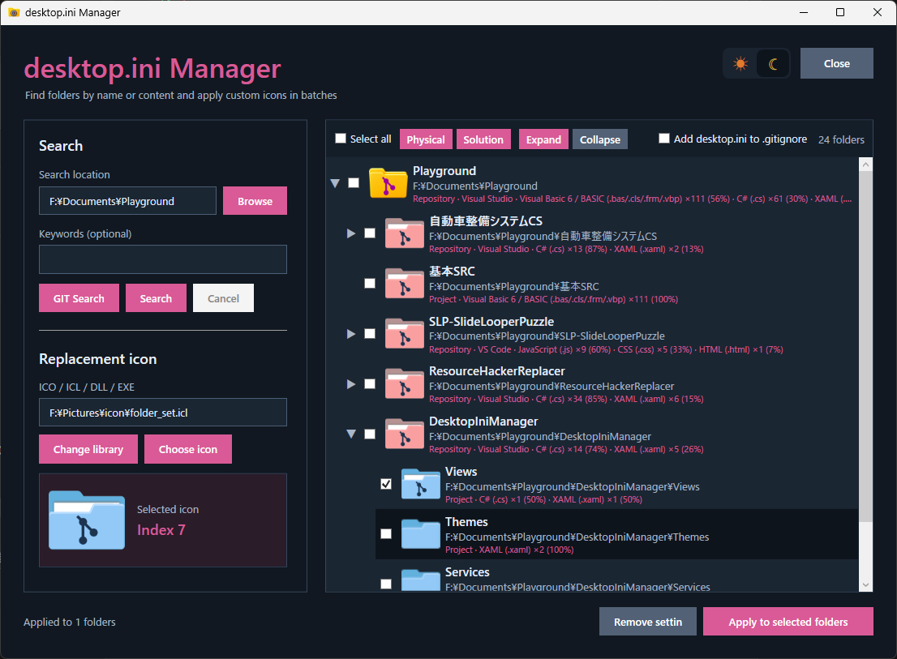
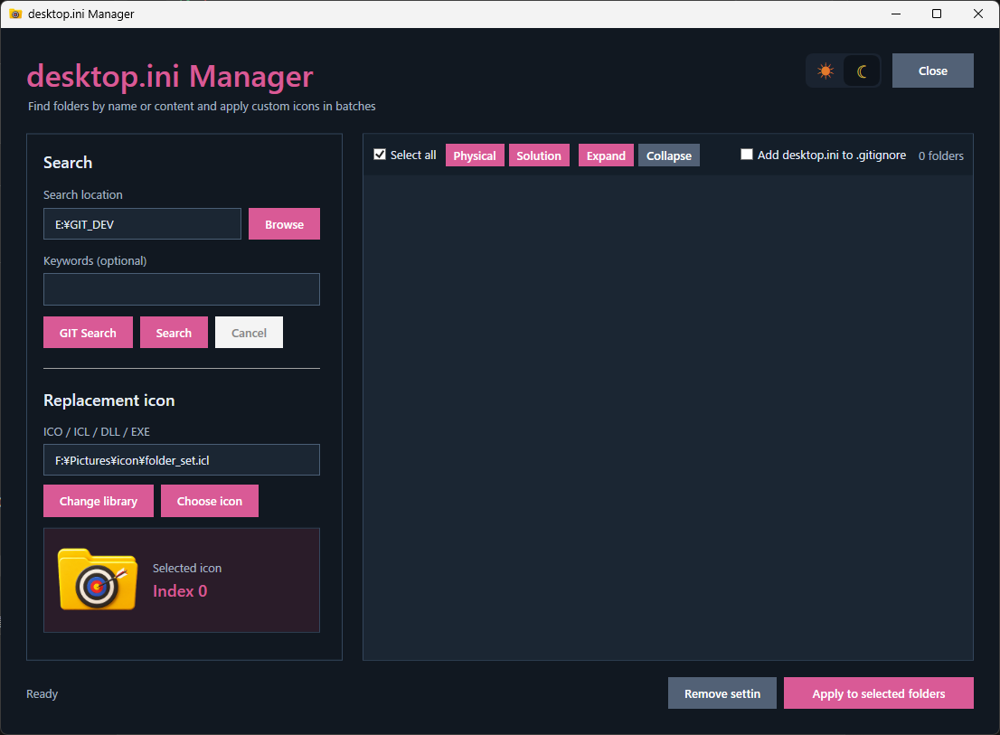

# DesktopIniManager

DesktopIniManager is a Windows developer tool for understanding real project layouts and organizing folders with custom icons through `desktop.ini`.

It discovers Git repositories, projects, source-language composition, and Visual Studio solution relationships without changing the project files themselves. The same search engine can also classify ordinary media and document folders by extension.



## Download

[](https://github.com/K-Tamashiro/DesktopIniManager/releases/latest/download/DesktopIniManager-win-x64.zip)

Download `DesktopIniManager-win-x64.zip`, extract it to a writable folder, and run `DesktopIniManager.exe`.

### Requirements

- Windows 10 or Windows 11, x64
- .NET Framework 4.8

## Why DesktopIniManager?

Large repositories often contain several solutions, many service projects, shared output folders, and physical layouts that differ from Visual Studio's logical Solution Explorer. DesktopIniManager provides a quick view of both structures and lets developers make important folders recognizable in Explorer.

## Highlights

- Dedicated `GIT Search` for finding repositories and projects
- Physical folder tree with expandable repository and project nodes
- Visual Studio `.sln` parsing and logical Solution tree view
- Detection of projects inside monorepos, even when child projects do not contain their own `.git`
- Source-language and technology analysis with counts and percentages
- Support for C#, C/C++, JavaScript, TypeScript, PHP, Java, Delphi, VB6, VB.NET, HTML, CSS, SQL, and many more
- Multi-extension folder search such as `mp3 wav`
- Batch folder-icon application and removal
- ICO, ICL, DLL, and EXE icon-resource browser
- Bundled folder icon set
- Optional `desktop.ini` entry in `.gitignore`
- Physical and Solution views
- Light and dark themes
- Context-menu action for narrowing the search location
- Visible-row-only batch selection for safe tree operations

## Application overview



1. Choose a search location.
2. Use `GIT Search`, or enter one or more custom keywords and select `Search`.
3. Inspect the Physical or Solution tree.
4. Expand only the folders you want to work with and select the visible rows.
5. Choose an icon and apply it to the selected folders.

Collapsed child nodes are excluded from Apply and Remove operations. Turning `Select all` off clears every node, including collapsed children; turning it on selects visible nodes only.

## Repository and language analysis

Developer mode recognizes common project definitions such as:

- `.sln`, `.slnx`, `.csproj`, `.vbproj`, `.fsproj`, `.vcxproj`
- `.vbp`, `.dproj`, `.dpr`
- `package.json`, `composer.json`, `pyproject.toml`
- `Cargo.toml`, `go.mod`, `pom.xml`
- Gradle, CMake, Make, and Xcode projects

Generated and dependency folders such as `.git`, `.vs`, `bin`, `obj`, `node_modules`, `vendor`, `dist`, and `target` are excluded from language statistics.

## Icon browser

DesktopIniManager includes `Assets/folder_set.icl` and uses it as the initial icon library. A different ICO, ICL, DLL, or EXE can be selected at any time, and the last path is restored on the next launch.


## How folder icons are applied

For each selected folder, DesktopIniManager:

1. Writes a `[.ShellClassInfo]` section with the selected `IconResource`.
2. Marks `desktop.ini` as Hidden and System.
3. Applies the System attribute to the folder.
4. Notifies Windows Explorer of the icon change.

The selected icon library stays at its current path. Moving or deleting it can make assigned folder icons unavailable.

`Remove settings` deletes `desktop.ini`, clears the folder's System attribute, and refreshes Explorer.

## Build from source

Requirements:

- Visual Studio 2022 or newer
- .NET desktop development workload
- .NET Framework 4.8 targeting pack

Build with Visual Studio's MSBuild:

```powershell
MSBuild.exe DesktopIniManager.sln /t:Rebuild /p:Configuration=Release
```

The project is a dependency-free WPF application targeting .NET Framework 4.8 and x64 Windows.

## Release package contents

```text
DesktopIniManager.exe
Assets/
  folder_set.icl
README.md
```
