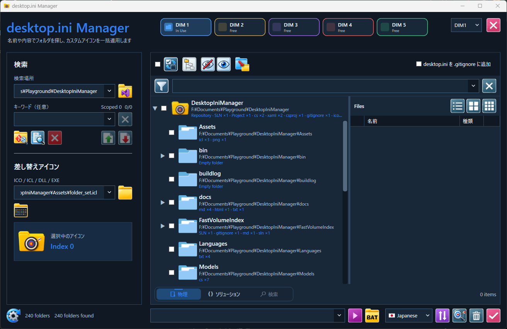

# DesktopIniManager v4.0.0

DesktopIniManager (DIM) is a Windows workspace for exploring development folders and Visual Studio solutions, finding files, running scoped searches, comparing folders, viewing differences, and managing folder icons through desktop.ini.

[Website](http://dim.zebrasoft.co.jp/) · [GitHub downloads](https://github.com/K-Tamashiro/DesktopIniManager/releases) · [v4.0.0 release notes](docs/releases/v4.0.0.md) · [Japanese readme](docs/README.txt)

## Download and setup

Download **DesktopIniManager-v4.0.0-win-x64.zip** from the v4.0.0 GitHub release assets, rather than GitHub's source-code archive. A matching .zip.sha256 file provides its SHA-256 checksum.

- Windows 10 or Windows 11, x64.
- .NET 10 Desktop Runtime (x64), installed separately.
- Visual Studio Build Tools / MSBuild or the .NET SDK for the corresponding solution build commands.
- An external editor or diff/merge tool is optional.

Extract into a fresh folder and run **DesktopIniManager.exe**. Keep all DLLs, JSON files, Assets, and Languages together. ExcelDataReader and the bundled PdfPig libraries are required for Document Grep. The default folder icon library is resolved from the application's Assets directory.

## What's new in v4

- Five independent DIM process slots, each with its own settings and history.
- Dark, Light, and DIM1–DIM5 themes, restored on startup.
- Separate Code Grep and Document Grep profiles, with Excel/PDF content searching.
- Fixed single-root folder row, folder-name hit highlighting/counting, resizable columns, and saved pane/column widths.
- Source-yellow and Target-blue DIFF VIEW frames, a draggable difference map, and an all-lines / differences-only toggle whose state is saved on close.
- Incremental comparison results, folder-building progress, and one-way Source-to-Target selection of an existing same-name folder.

## Main window

Set a Target root and inspect its Physical tree or Visual Studio Solution structure. File search also matches folder names. Checked folders restrict File Search and Scoped Grep to their subtrees.

Selecting a physical folder lists files below it: immediate files appear first in white; descendant files use muted text. Solution view follows the useful parts of Solution Explorer, omitting management folders such as .git and .vs. Switch between the file list and two- or three-column icon views.

The tree supports check/uncheck all, inversion, expand/collapse, checked-folder filtering, name filtering, and compact/large display. Hits are marked, and selecting a search result reveals its containing folder. The Target root row stays visible in a single-root tree.

Context menus can set the Target, open Explorer, export tree / tree /f / file-list output to an editor, and pass a folder to Scoped Grep. Solution menus provide Visual Studio/MSBuild and .NET SDK builds using project configurations.

Choose icons from ICO, ICL, DLL, or EXE resources, apply them to checked folders through desktop.ini, or reset existing customizations. Optionally add desktop.ini to .gitignore. Empty/content icons and network/cloud presentation help distinguish folder states.

Drag folders out with their immediate files, or drag multiple files from the file list. The Batch File Launcher supports %d% (directory path), %f% (selected file path), and %n% (file name).

## Developer Differencer

Compare a yellow Source tree with a blue Target tree. Paths are indexed when selected; folder-label buttons provide explicit rescans. Source-to-Target folder matching selects an existing same-name folder under the current Target. It does not create folders or run in reverse.

Comparison uses **file size and modification time**, or size alone when date comparison is disabled. It is not a content-hash comparison. One-sided files/folders are included. Environment/build artifacts are normally excluded, with separate obj and bin visibility controls.

Filter Same, Different, Source-only, Target-only, obj, bin, and checked items. Same files are hidden by default. The Same-check action can include identical files in synchronization or ZIP selections.

Keep up to 20 dated comparison tabs, newest on the left. Delete tabs to make room at the limit. Refresh the whole comparison or the selected folder, and run Solution Clean where appropriate.

Create a ZIP from checked Source or Target files while preserving relative paths. Drag the ZIP icon to export the selected folder structure without creating an archive. Synchronization is available in either direction; review its direction and operations in the confirmation window.

## DIFF VIEW

Double-click a supported comparison file to open the read-only viewer. Text differences have syntax highlighting, original line numbers, colored Source/Target frames, and a central difference map. Supported images use a separate image view; unsupported binary formats are excluded.

- Icon **110** switches from all lines to differences only; icon **109** returns to all lines.
- Differences-only mode shows complete changed sections without unchanged context lines. Omitted sections have markers such as “52 filtered lines”.
- **Ctrl + 0** performs the same toggle. Closing the viewer saves its last mode for the current slot.
- Jump between sections/files, open either side in an external editor, or launch an external diff/merge tool.

DIM does not edit or merge file contents in this viewer. Scanning, searching, comparing, and viewing leave source contents unchanged. Explicit icon application, synchronization, Clean/build commands, ZIP/export, and external tools can write files.

## Scoped Grep

Keep multiple search folders, drag folders into the scope list, select active scopes by checkbox, or refresh scopes from the main window. Search with regular expressions, case sensitivity, and whole-word matching.

Language profiles manage editable extension sets. **Code Grep and Document Grep are separate.** Document searches Excel (.xls, .xlsx, .xlsm) and PDF contents; use Plain for ordinary text files. Document and code searches are not mixed into a universal all-file search.

Excel results show **[Sheet name][Cell address] matched content**. PDF results identify the page. Image-only scanned PDFs require OCR outside DIM.

Results are grouped by file, with red keyword highlighting, collapsible groups, filters, horizontal scrolling, editor export, file saving, and group-header drag-out. Append searches add hits to existing file groups. Up to 20 search tabs retain results and settings. External editor presets support file, line, and column arguments.

## Slots, themes, and languages

DIM1–DIM5 run as independent processes. **In Use** identifies the current slot, **Free** starts a new process, and **Open** activates an existing process. Settings and histories are stored under %LOCALAPPDATA%\DesktopIniManager\dim-N.

Choose Dark, Light, or a DIM1–DIM5 theme. English, Japanese, Simplified Chinese, and Korean UI resources are included. A history reset command is also available.

## Keyboard controls

| Keys | Action |
| --- | --- |
| Ctrl + 1 / 2 / 3 | Main / Developer Differencer / Scoped Grep |
| Ctrl + Space | Cycle through the three main windows |
| Arrow keys | Scroll DIFF VIEW vertically/horizontally |
| Page Up / Page Down | Page scroll in text DIFF VIEW |
| Shift + mouse wheel / thumb wheel | Horizontal scrolling |
| Ctrl + Up / Down | Previous / next difference section |
| Ctrl + Left / Right | Previous / next comparison file |
| Ctrl + 0 | Toggle all lines / differences only |

## Distribution and support

DIM is freeware by Tamayan / ZEBRASOFT. Copyright remains with the author. See the Japanese readme for the disclaimer.

- Website: http://dim.zebrasoft.co.jp/
- Repository / issue reports: https://github.com/K-Tamashiro/DesktopIniManager
- Contact: tamayan@zebrasoft.co.jp

For maintainers, scripts/Build-Release.ps1 -PrebuiltDirectory <release-output> packages existing v4.0.0 binaries without building. Omitting that option runs dotnet publish. Archives/checksums go to release/ for upload as GitHub assets; they are not stored in Git.
